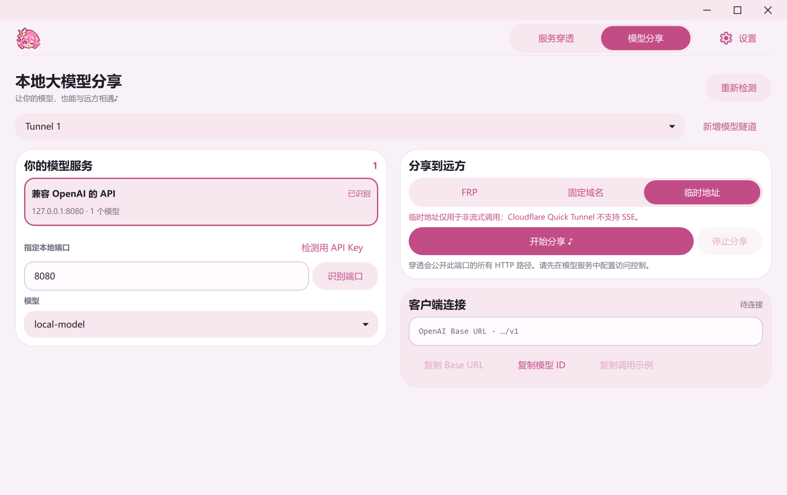
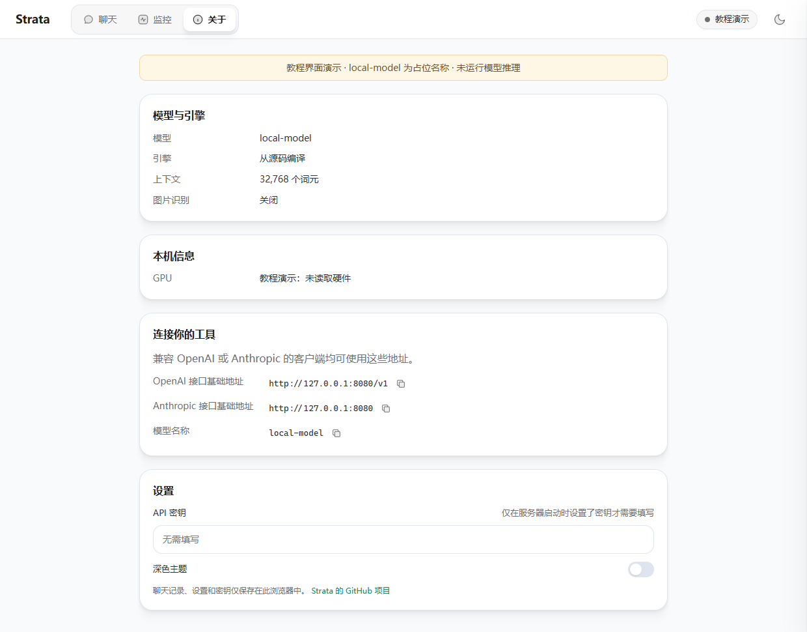
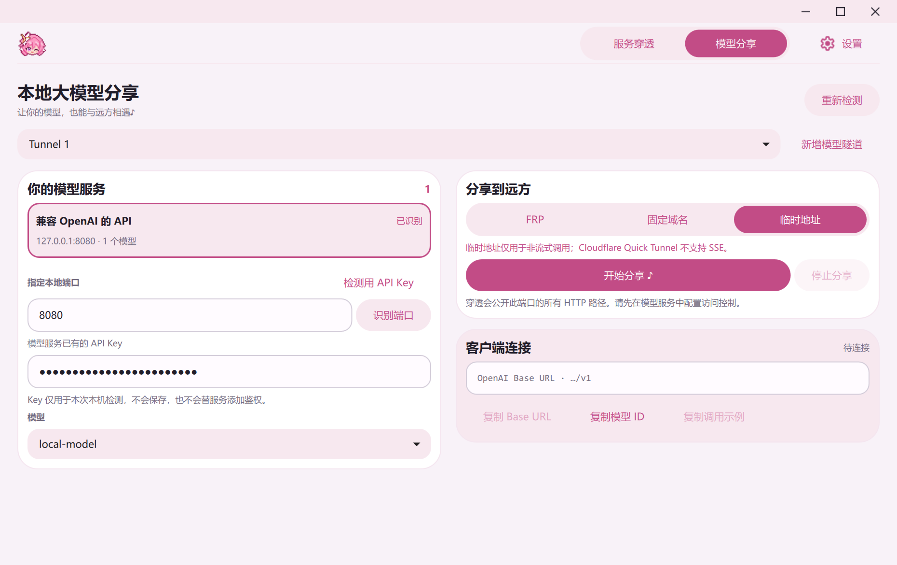
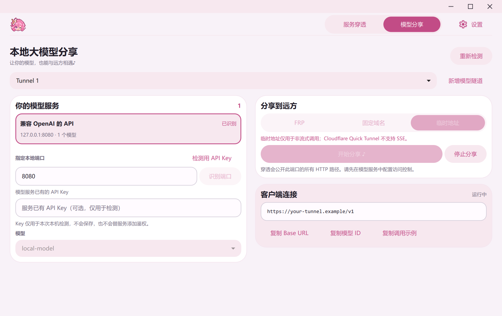
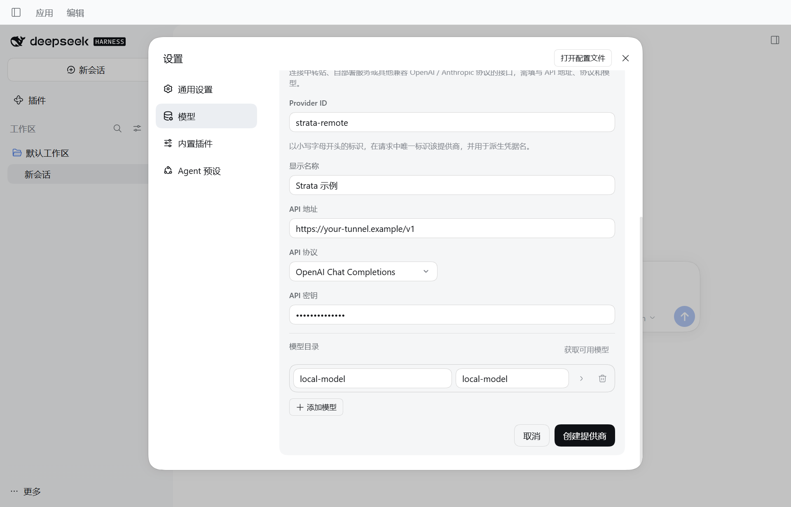
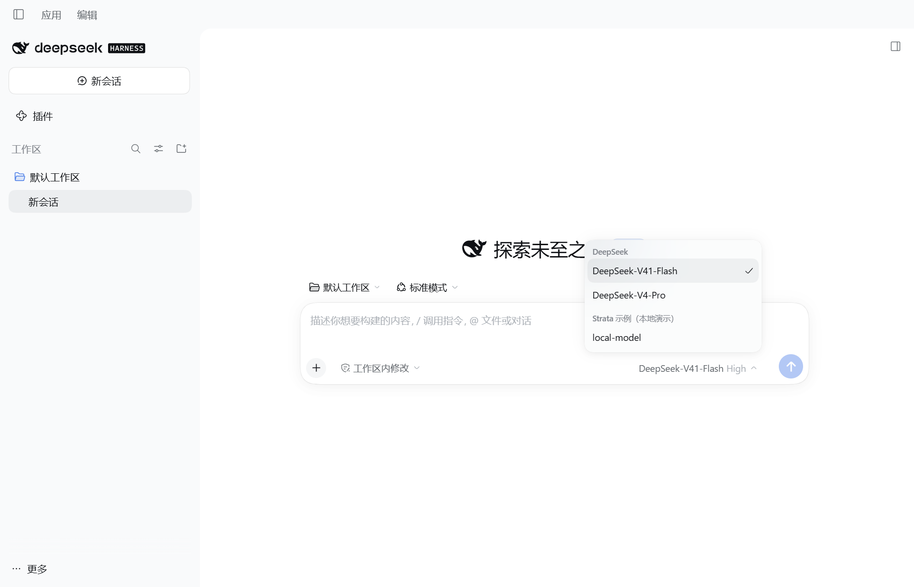
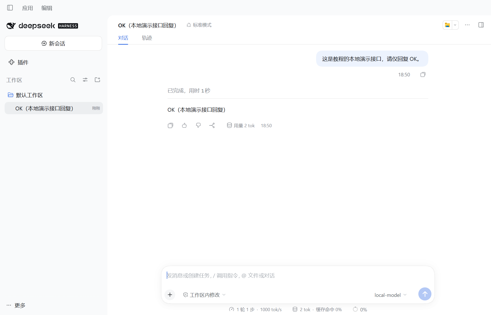
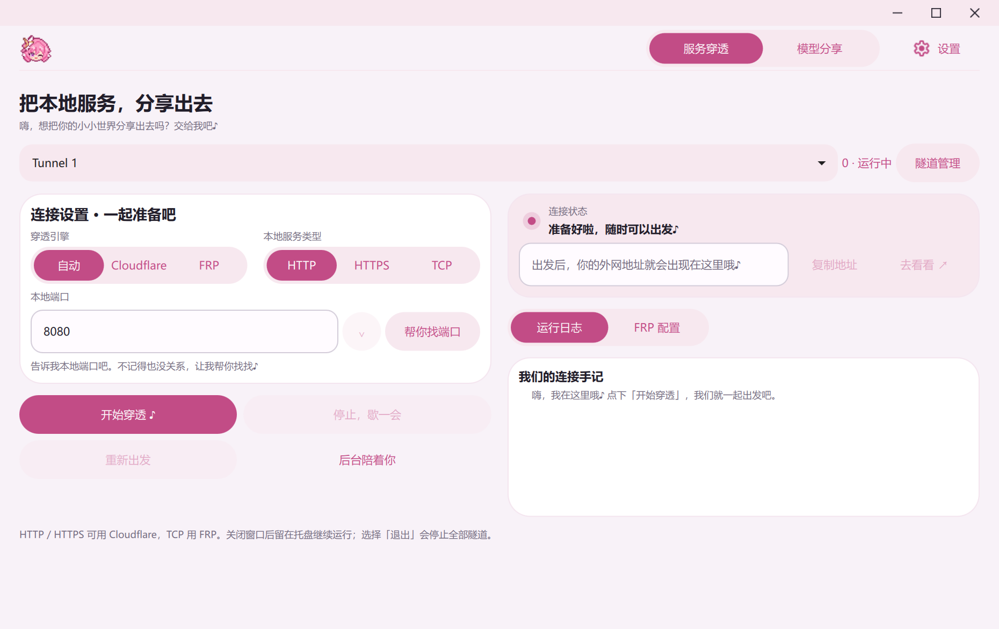
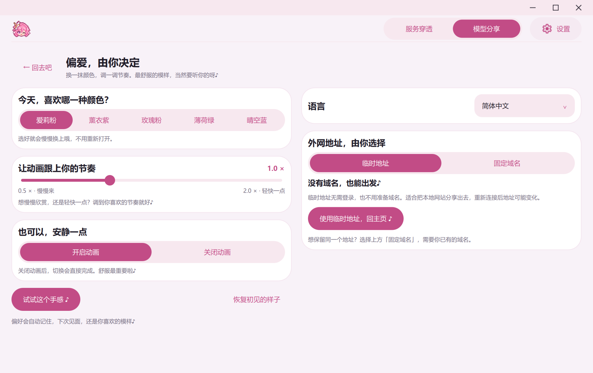

# Elysia Tunnel GUI · Local model sharing

[简体中文](README.md) | English

[](https://github.com/FuFu-Flash/elysia-tunnel-gui/releases/latest)
[](#download-and-run)
[](PACKAGING.md)

**Automatically discover local model APIs and share them with remote clients in one click.**

Let your local model answer remote requests. For example, run a model in [Strata](https://github.com/Niko1221/Strata), automatically discover and share its API with **Elysia Tunnel**, then connect [DeepSeek Harness (DSH)](https://github.com/deepseek-ai/deepseek-harness) to that address. The model keeps running on your computer; the remote client sends requests through the shared API.

This Windows app supports Cloudflare / FRP, multiple tunnels, and background operation in the system tray. It can also share a local website or another HTTP service by its port.

**[Download ElysiaTunnel.exe](https://github.com/FuFu-Flash/elysia-tunnel-gui/releases/latest/download/ElysiaTunnel.exe)** · [Strata + DSH walkthrough](#strata-dsh-tutorial) · [Latest release](https://github.com/FuFu-Flash/elysia-tunnel-gui/releases/latest)



## Download and run

Download `ElysiaTunnel.exe` and double-click it. The Windows 10 / 11 x64 package includes Python, Qt, Cloudflare, and FRP tunnel engines, so there are no separate dependencies to install. The single-file executable extracts its runtime at startup; give it a moment to open. Establishing a tunnel requires an internet connection.

The v0.4.0 EXE is about 75.33 MiB. The release also includes a `.sha256` file to verify your download.

<a id="strata-dsh-tutorial"></a>

## Illustrated walkthrough: Strata → Elysia → DeepSeek Harness

Run the model in Strata, share its API with Elysia, and connect DSH as the remote client. Complete **steps 1–3 on the computer running the model**, then **step 4 on the computer running DSH**. Install Strata and DSH separately.

The screenshots show real interfaces with demonstration data: `local-model` is a placeholder model ID, and `https://your-tunnel.example/v1` is an example address that cannot be used. Use your own detected model and public address. The DSH screenshots use **0.2.0-rc.2**; later versions may have different menus.

**Cloudflare temporary addresses can be used with DSH. Configure a server API key before sharing Strata.** A temporary address has already worked with the actual DSH client: it fetched the model list and completed a short reply, and the user has also confirmed that their temporary address works with DSH. You do not need a Cloudflare account, your own domain, or an FRPS server for this route.

**Before sharing a protected Strata model API: configure the key in Strata and restart → enter the same key in Elysia's Model sharing page and verify with Detect port → start sharing → enter the same key in DSH.** Entering a key only in DSH does not complete Elysia's verification. Ordinary services without authentication can be shared without a key.

Cloudflare documents that [Quick Tunnels do not support SSE](https://developers.cloudflare.com/tunnel/get-started/quick-tunnels/#limitations). The successful DSH requests show that the tested connection is usable; they do not guarantee every streaming response, long reply, client version, or long-running session. The earlier public DSH test did not have Strata's server authentication enabled, so it did not verify API-key authentication.

### 1. Configure Strata's server key, then start the model

Follow [Strata's setup instructions](https://github.com/Niko1221/Strata#install) to install Strata and prepare your model. The Windows entry point is `START-HERE.bat`. Strata's project documents its installation, model downloads, and hardware requirements.

**Enable Strata's server API key before sharing.** After the first setup, locate the `strata-<model>.json` configuration for the model you are actually running in the Strata directory; see its [configuration notes](https://github.com/Niko1221/Strata/blob/main/docs/INSTALL.md#where-things-are-stored). Open that file in a text editor and keep its existing settings. Add a non-empty `api_key` property inside the outermost braces, or replace its value if it already exists:

```json
"api_key": "REPLACE_WITH_YOUR_OWN_RANDOM_KEY"
```

The example only shows the property's JSON syntax; **do not replace your whole configuration with it, and do not use the example text as your key**. Choose your own random long secret. Separate this property from other properties with commas, without adding a trailing comma before the closing brace. Do not add a duplicate `api_key` property.

Save the file, stop the running Strata service, and start the same model again with its `run-<model>.bat`, or select the same model through `START-HERE.bat`. **Refreshing the web page does not restart the server or apply this setting.** Keep the service listening on `127.0.0.1`; Elysia forwards that local service. See [Strata's server-key instructions](https://github.com/Niko1221/Strata/blob/main/docs/DETAILS.md#using-it).

Wait for the model to be ready, open `http://127.0.0.1:8080`, and select **About** to check the API address and model name. If you changed the port, use your own port in the following steps. The **API key** field on Strata's web page is the key that the browser sends to the server. It does not enable server authentication. Enter the same key there to use the protected service. You will also use this key in Elysia and DSH below.

If the service still rejects this key after restarting, check whether your start script supplies `--api-key` or the `STRATA_API_KEY` environment variable. These can override the JSON value; use the key that the running server actually has configured.



*Strata interface demonstration with placeholder model and runtime data. Complete the JSON key configuration and server restart before continuing; the pictured browser input cannot replace those steps.*

### 2. Detect the service and start sharing

Open Elysia Tunnel's **Model sharing** page. The app automatically looks for local model APIs. A protected service may initially show **Verify first**. **You must enter the Strata key inside Elysia and finish verification before sharing this protected model API:**

1. Enter Strata's port (default `8080`).
2. Enter the same server key configured in step 1 in **Existing model server API key**, then click **Detect port**.
3. Wait for successful verification and the model list, then select the service and model. Use **Scan again** if you started Strata after opening the page.

When first configuring authentication, check it with an empty or incorrect key: click **Detect port** and the service should remain at **Verify first**. Then enter the correct key and detect again; the model list should appear. With server authentication enabled, a missing or incorrect key makes Strata reject `/v1/models` with HTTP `401`, and Elysia cannot start sharing that unverified model API. If an incorrect key still reads the list, check the active model's configuration and restart before sharing.

Elysia uses the entered key for that detection attempt, then clears the field. It does not save the key, enable authentication on Strata, or fill the key into remote clients. Each DSH client must enter the same key separately in step 4.



*Detection interface demonstration with a masked demonstration key. Model names come from the service's actual list. Detection only reads that list; it does not load models or run inference, and the detection key is not saved. The v0.4.0 interface in these screenshots still contains the older non-streaming-only hint for temporary addresses; that hint does not reflect the successful DSH connection described here.*

In **Model sharing**, choose **Temporary address** and click **Start sharing ♪**. Wait for the connection and public address. This route requires an internet connection but no account login, domain binding, or FRPS configuration. Detection alone does not make the service public.

If you later want a stable address, **Fixed domain** is an optional alternative: authorize your Cloudflare account and bind your own Cloudflare-managed domain in Settings. **FRP** is another option when you have an FRPS server and an accessible remote forwarding port. Neither is required for a temporary address. Public model sharing through these alternatives has not yet been tested here.

### 3. Copy the client address and model ID

Once connected, click **Copy Base URL** and **Copy model ID** under **Client connection**. A temporary Base URL looks like `https://<assigned-name>.trycloudflare.com/v1` and must include its final `/v1`. Copy the actual model ID rather than the screenshot's `local-model` placeholder.



*Connection information demonstration with Temporary address selected. The `your-tunnel.example` address and connected status are placeholders; use your own generated `trycloudflare.com` address after connecting. The remote client cannot use the model computer's `127.0.0.1:8080`.*

### 4. Connect DeepSeek Harness

Install and open [DeepSeek Harness](https://www.deepseek.com/en/download/). In the bottom-left menu, open **More → Settings → Models**, click **Add model provider**, and choose **Custom model API**. Fill in the form:

| DSH field | What to enter |
| --- | --- |
| Provider ID | For example, `strata-remote`; start with a lowercase letter and use only lowercase letters, digits, and hyphens |
| Display name | A name such as `Strata` |
| API protocol | **OpenAI Chat Completions** |
| Base URL | The public address copied from Elysia, ending in `/v1` |
| API key | **Required: exactly the same server key configured in Strata and verified in Elysia** |
| Model ID | The ID copied in step 3, or a model selected after fetching the list |



*DSH configuration demonstration. Replace the example address, enter your own Strata API key, and select OpenAI Chat Completions.*

Click **Fetch available models**, select your model, and click **Add selected**. If DSH cannot fetch the list, use **Add model** and paste the exact model ID copied in step 3. Finish with **Create provider**.

Return to the conversation, click the current model name at the bottom of the message box, and open the model list to select the newly added Strata model.



Send a short message to check the connection, such as “Reply with exactly OK. Do not call any tools.” Keep Strata and Elysia running while using the client.



*DSH conversation demonstration using a local test service; this is not a new public Strata test. See “What has been checked” below for the earlier real DSH request.*

Click **Stop sharing** or exit Elysia to end remote access through this tunnel. A temporary address changes when reconnected; a fixed domain uses the domain you configured.

Choosing a model selects it for the client example. Sharing exposes the entire service port, so other models and HTTP paths may also be accessible. A detection key does not add authentication to your model server. Configure access control when using other services, too; [Ollama's local API does not require authentication](https://docs.ollama.com/api/authentication).

## Share a local website

Want to show a friend the website running on your computer without digging through commands? Enter its port, click **Start tunnel**, wait for the public address, and send it over.

1. Start your local website or application and check that it works on this computer.
2. Open **Tunnels**, choose its protocol, and enter the local port. For `http://localhost:8080`, choose HTTP and enter `8080`.
3. Click **Start tunnel** and copy the public address once connected. Cloudflare temporary addresses require no account or domain.

Stopping the tunnel ends access through that public address. Reconnecting creates a new temporary address.



## Everyday use

- **Manage several tunnels.** Give each its own name and port, check its address and logs, and start or stop them individually or together.
- **Keep running in the tray.** Closing the window hides it in the system tray. Choose **Exit** to stop every tunnel and close the app.
- **Save your FRPS servers.** Keep several server profiles and choose one for each tunnel. Cloudflare tunnels share one account.
- **Detect local ports and read live logs.** Find listening ports, copy public addresses, and stop or restart connections.
- **Elysia pink, themes, and button ripples.** Adjust the theme and animation speed in Settings, or disable animations. The window has a top control area without title text and supports dragging, resizing, maximizing, and restoring.
- **简体中文 / English.** Switch the interface language instantly; your choice is saved. Raw tunnel-engine logs remain in their original language.
- **Adapt to window size.** Wide windows show controls and status side by side. Narrow windows use a scrolling single column. Settings opens with a smooth transition.



## Tunnel options

| Option | Use | What you need |
| --- | --- | --- |
| Cloudflare temporary address | Temporarily share HTTP / HTTPS services and model APIs; DSH model-list retrieval and a short reply have been tested successfully | A running local service and an internet connection; protected model APIs also require the server key |
| Cloudflare fixed domain | Give your service a stable address on your own domain | A Cloudflare-managed domain, account authorization, and a bound tunnel |
| FRP | Forward TCP ports through your own server | FRPS configuration and an accessible remote forwarding port |
| Auto mode | Prefer Cloudflare for HTTP / HTTPS, with configured FRP as a fallback | The configuration required for each transport |

Fixed-domain mode does not silently switch to a temporary address. Real Cloudflare account authorization, named tunnel creation, DNS binding, and fixed-domain connectivity remain untested. See the [fixed-domain notes in Chinese](docs/cloudflare-fixed-domain.md). Real FRPS forwarding also remains untested. FRP model sharing currently uses unencrypted HTTP for public access.

Tunnel configurations are saved locally for next time, but connections do not start automatically. Saved FRPS tokens use Windows user-level encryption.

## What has been checked

Local Windows 11 checks cover language switching, Settings navigation and return, independent tunnel-process management, FRPS profile switching, tray behavior, and cleanup on exit. Interaction checks cover button ripples, keyboard input, animation speed, and disabling animations. Window checks cover resizing without shifting the top-left position, maximizing to the screen's work area, and restoring the original position and size.

Model discovery and sharing checks cover reading model lists, detection-key handling, copying client addresses and examples, preserving existing tunnel configurations, HTTP forwarding, and cleanup. Earlier tests used a Cloudflare temporary address to read a Strata server's model list publicly and complete one non-streaming request. The actual DeepSeek Harness (DSH) Windows client also fetched models and completed one short reply, and the user has since confirmed that their temporary address works with DSH. These results establish that temporary-address model sharing can work with DSH in the tested configuration.

Strata's server authentication was not enabled in that earlier public DSH test. The client key value was not retained, so the test does not establish whether DSH sent no key or a placeholder key, and it does not verify server API-key authentication. Public DSH requests with Strata's server authentication enabled have not been tested here.

One successful DSH request does not establish general SSE streaming support on Quick Tunnels or verify every model, client, or long-running session. Windows 10, real FRPS forwarding, Cloudflare account and fixed-domain operations, HTTPS origin certificates, and long-running stability remain unverified.

The current EXE was launched in an isolated environment with only the system PATH and no preinstalled Python or Qt. Checks covered the model page with animations disabled, local model API detection, Settings navigation, window resizing, and exit. Bundled source, UI resources, and both engines passed verification. At this computer's 150% display scale, the maximized client area exactly matched the screen's work area. See the [packaging notes in Chinese](PACKAGING.md) for the build process and the [animation measurements in Chinese](docs/animation-performance.md) for the devices and test scope.

## Run or build from source

Keep the full project directory, install its dependencies, and launch the app:

```powershell
python -m pip install -r requirements.txt
pythonw tunnel_gui.pyw
```

When running from source, missing tunnel engines are downloaded from their official releases and checked with SHA-256. Release executables include the engines; the source repository does not contain their binaries. Account certificates, tunnel credentials, and personal settings are not distributed with the repository or executable.

See [packaging notes in Chinese](PACKAGING.md) for build instructions, dependency versions, and verification.

## Credits

Thanks to [FRP](https://github.com/fatedier/frp) and [Cloudflare Tunnel](https://github.com/cloudflare/cloudflared) for the connection engines. The settings icon comes from Google's official [Material Symbols](https://github.com/google/material-design-icons). Window controls use the official [QWindowKit](https://github.com/stdware/qwindowkit) QML example and icons, adapted to the app's theme.

Third-party licenses and source references are included in `third_party_licenses`, `assets/icons`, and `qml/vendor/qwindowkit`, and bundled with the executable.
