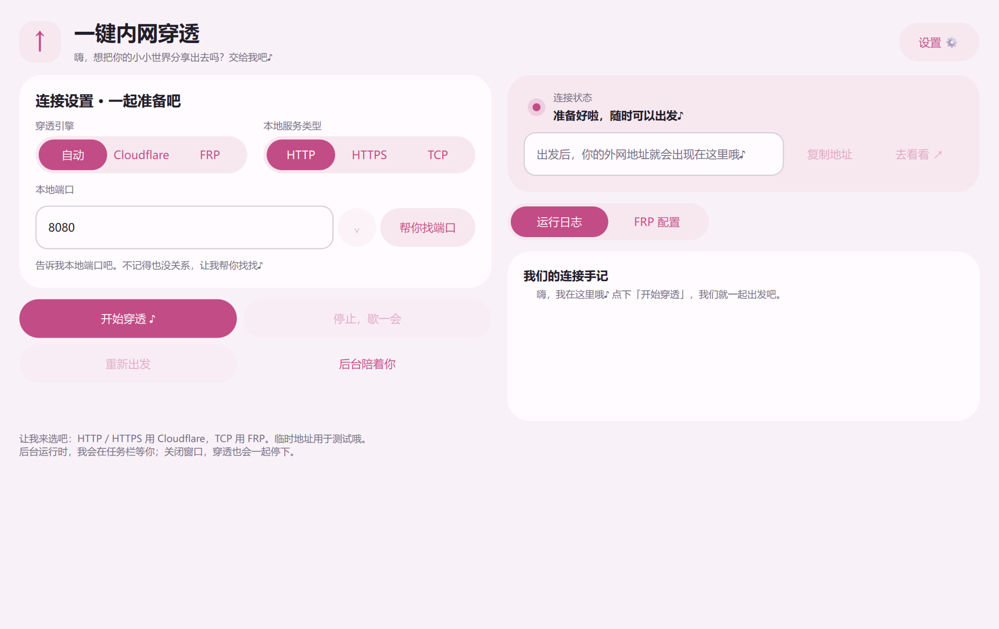

# 一键内网穿透 · Elysia Tunnel GUI

想把本地跑着的小网站发给朋友看看，却又不想临时翻一堆命令？这个小工具就是干这件事的。

填个端口，点一下「开始穿透」，等外网地址出现，再复制给对方。

## 直接打开就能用

在 [Releases](https://github.com/FuFu-Flash/elysia-tunnel-gui/releases) 下载 `ElysiaTunnel.exe`，双击运行。适用于 Windows 10 / 11 x64，已包含 Python、Qt 和两种穿透内核，无需另行安装依赖。单文件启动时会解压运行资源，因此首次打开需要稍等片刻。

本地网站或应用要先开启。比如它现在通过 `http://localhost:8080` 访问，就选 HTTP，填 `8080`，再点「开始穿透」。建立隧道需要联网。

## 这次界面变了什么

- 默认采用「爱莉粉」，设置里可以换颜色、调节动画速度或减少动态。
- 主页改成横向双栏：左侧准备连接，右侧查看状态、地址和日志。
- 设置页把外观与 Cloudflare 配置并排放置；窄窗口仍可滚动访问。
- 界面迁移到 Qt Quick，并修复设置页切换卡顿和返回白屏问题。

## 穿透方式

- **Cloudflare 临时地址**：分享本地 HTTP / HTTPS 服务，重启后地址可能变化。
- **Cloudflare 固定域名入口**：在设置中通过浏览器授权，创建命名隧道并绑定自己的域名。需要已托管到 Cloudflare 的域名及账户权限；登录、创建、DNS 绑定和固定域名连通性尚未实测，见 [功能说明](docs/cloudflare-fixed-domain.md)。
- **FRP**：连接自己的 FRPS 服务端，进行 TCP 端口映射。需要填写服务器配置并放行远程映射端口。
- **自动模式**：HTTP / HTTPS 优先使用 Cloudflare；配置好 FRP 后可作为后备方案。固定域名模式不会自动换成临时地址。

支持本机监听端口检测、实时日志、复制外网地址、一键停止和重启。最小化后继续运行，关闭窗口会停止穿透；后台运行指最小化到任务栏。

分享前请确认本地服务已有适当的访问保护。软件不会替你关闭系统安全防护。

## 测试情况

已在本机 Windows 11 上检查界面、设置切换、横向布局、端口检测、Cloudflare 临时隧道公网访问，以及停止、重启和关闭后的进程清理。EXE 已完成独立启动检查；两个内核通过版本运行及校验检查。

Windows 10、FRP 实际转发、Cloudflare 账户与固定域名操作、HTTPS 源站证书及长期稳定性尚未验证。动画测量来自一台 160 Hz 设备，不能代表所有屏幕与驱动，详见 [性能记录](docs/animation-performance.md)。

## 从源码运行与打包

保留完整目录，安装 `requirements.txt` 中的依赖后，用 `pythonw tunnel_gui.pyw` 启动。源码运行时，缺少的穿透内核会从官方发布页下载并校验 SHA-256。

打包方法与依赖版本见 [打包说明](PACKAGING.md)。发布的 EXE 包含内核，源码仓库不保存内核二进制。账户证书、隧道凭据和个人设置不随仓库或 EXE 分发。

主要文件：`tunnel_gui.pyw` 为入口，`qt_ui.py` 和 `qml/Main.qml` 负责界面，`tunnel_core.py` 管理穿透进程，`cloudflare_account.py` 处理账户与固定域名操作。旧 Tk 界面保留作历史测试参考。

感谢 [FRP](https://github.com/fatedier/frp) 和 [Cloudflare Tunnel](https://github.com/cloudflare/cloudflared) 提供连接能力。第三方许可证及源码来源保存在 `third_party_licenses` 中，并随 EXE 打包。

准备好啦？把端口告诉我，我们一起出发吧。♪
